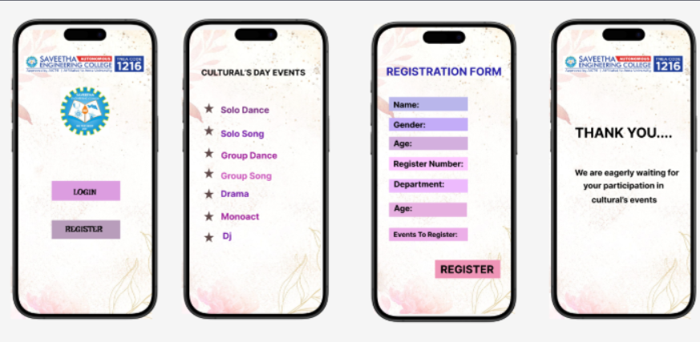

# Ex08 Event Registration Web Application
## Date: 05-11-2025

## AIM:
To design, develop and deploy a web application for event registration using Figma UI tool.

## UI DESIGN TOOL:
Figma

## DESIGN STEPS:

### Step 1:
Use frames to represent screens or sections.

### Step 2:
Add column grids for consistent spacing and alignment.

### Step 3:
Insert shapes, text, buttons, and icons.

### Step 4:
Use Auto Layout for flexible, responsive design.

### Step 5:
Define color, text, and effect styles globally for consistency.

### Step 6:
Name layers logically and group related elements.

### Step 6:
Link frames to show navigation or interactions.

### Step 7:
Select the specific frame while generating code using Anima plugin.

## CODE:
```
frame1

<div class="group-3">
  
  
  <div class="i-phone-15-pro">
    
  </div>
  
  
  <div class="rectangle-1"></div>
  <div class="rectangle-2"></div>
  <div class="login">LOGIN</div>
  <div class="register">REGISTER</div>
</div>

frame2

<div class="group-2">
  
  
  <div class="i-phone-15-pro">
    
  </div>
  
  
  
  
  
  
  
  
  
  <div class="drama">Drama</div>
</div>


frame3


<div class="i-phone-15-pro">
  
</div>


frame4

<div class="group-1">
  
  
  <div class="i-phone-15-pro">
    
  </div>
  
  <div class="we-are-eagerly-waiting-for">We are eagerly waiting for</div>
</div>
```


## OUTPUT:




## RESULT:
The program to design, develop and deploy a web application for event registration using Figma UI tool is completed successfully.
